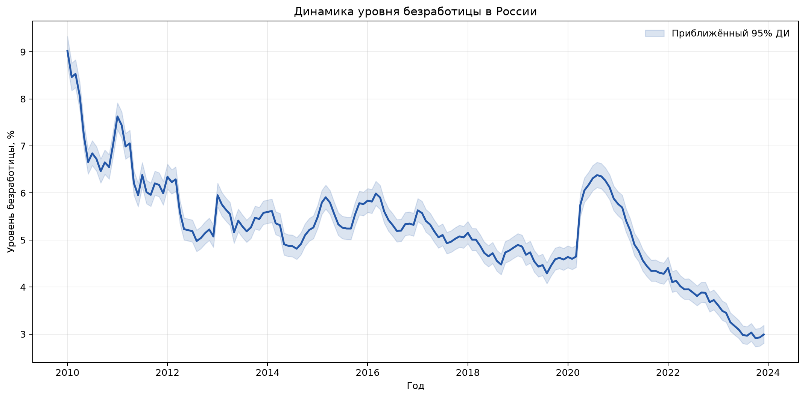
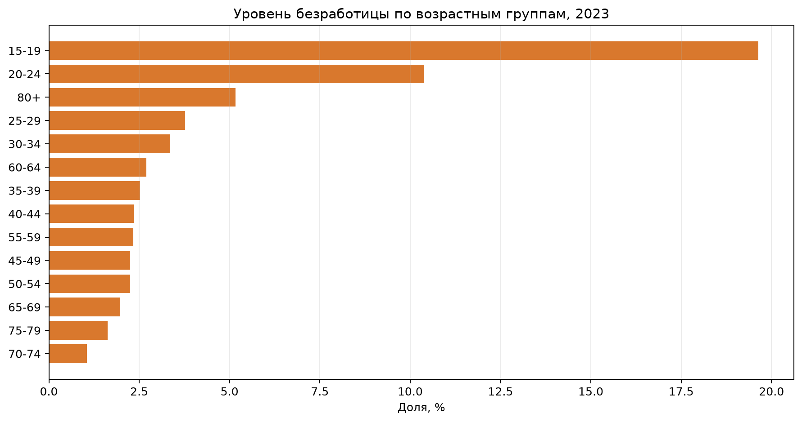
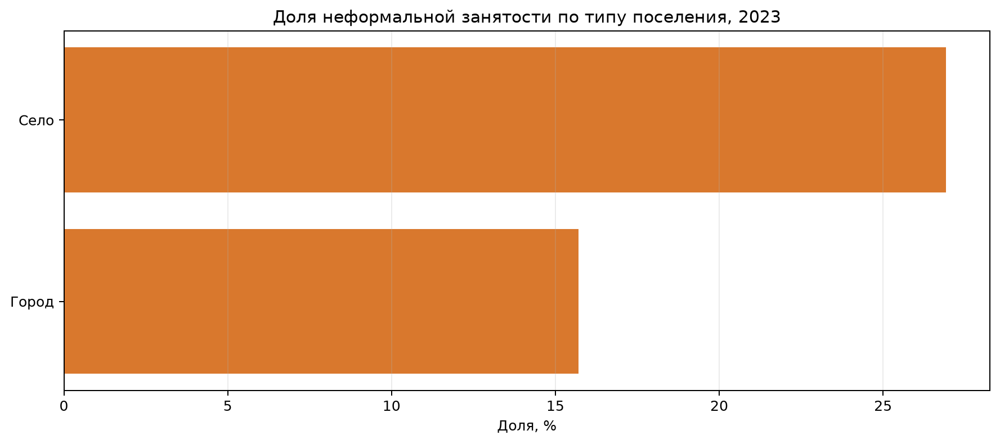

# Российский рынок труда: безработица и неформальная занятость

[](https://github.com/suxubnatam/russian-labor-market-analysis/actions/workflows/ci.yml)
[](https://www.python.org/)
[](LICENSE)

Воспроизводимый Python-проект для исследования российского рынка труда на
микроданных выборочного обследования рабочей силы Росстата за 2010–2023 годы.
Основной вопрос проекта: **как менялись безработица и структура занятости и
какие социально-демографические группы оказывались более уязвимыми?**

> Статус: полный пайплайн проверен на 12 264 280 наблюдениях за 2010–2023 годы;
> итоговые таблицы и графики воспроизводятся командами из раздела «Быстрый
> старт».

## Что демонстрирует проект

- обработку более 12 млн наблюдений без загрузки всего набора в память;
- гармонизацию схем SPSS-файлов разных лет;
- корректное применение месячных, квартальных и годовых весов обследования;
- расчёт безработицы и неформальной занятости по группам населения;
- приближённую оценку неопределённости взвешенных долей;
- тестируемый пакет, CLI и автоматические проверки в GitHub Actions.

## Ключевые результаты

- месячный уровень безработицы снизился с **9,02% в январе 2010 года** до
  **2,99% в декабре 2023 года**;
- во время пандемийного скачка максимум составил **6,38% в августе 2020 года**;
- в 2023 году уровень безработицы достигал **19,64% среди 15–19-летних** и
  **10,38% среди 20–24-летних**, заметно превышая показатели основных рабочих
  возрастов;
- в 2023 году неформальная занятость составляла **26,92% в сельской местности**
  против **15,71% в городах**;
- доля неформальной занятости в 2023 году составляла **19,45% среди мужчин** и
  **17,01% среди женщин**.







Все значения рассчитаны с весами обследования. Подробные оценки, интервалы и
объёмы выборки доступны в [`reports/tables/`](reports/tables/).

## Аналитический пайплайн

```text
SPSS-файлы (.sav)
        │
        ▼
проверка схемы → чтение чанками → гармонизация 21 переменной
        │
        ▼
Parquet, разбитый по годам
        │
        ▼
взвешенные показатели → CSV-таблицы → PNG-графики
```

Исходные файлы не хранятся в Git. Инструкция и ссылка на публичный набор
приведены в [`data/README.md`](data/README.md).

## Быстрый старт

Требуется Python 3.11 или новее. Проверенная версия — Python 3.12.

```bash
python3 -m venv .venv
source .venv/bin/activate
python -m pip install --upgrade pip
python -m pip install -e ".[dev,notebook]"
```

Поместите `.sav`-файлы в `data/raw/`, затем выполните:

```bash
labor-market validate
labor-market build
labor-market analyze
```

Повторная сборка уже существующего набора требует явного флага:

```bash
labor-market build --overwrite
```

Пути и размер чанка можно изменить через `--input`, `--output` и
`--chunk-size`. Справка доступна по команде `labor-market --help`.

## Структура

```text
src/labor_market_analysis/   пакет загрузки, расчётов и визуализации
tests/                       модульные и интеграционные тесты
notebooks/                   компактный аналитический отчёт
data/                        инструкция; сами данные исключены из Git
reports/                     итоговые таблицы и графики
```

Ноутбук не содержит копию пайплайна: он работает только с небольшими итоговыми
таблицами из `reports/tables/`. Благодаря этому расчёты доступны и из CLI, и из
обычного Python-кода.

## Методология

Уровень безработицы определяется как отношение взвешенного числа безработных к
взвешенной численности рабочей силы (занятые + безработные). Для месячных
оценок используется `vesa`, для квартальных — `ves_kvart`, для годовых —
`vesa_ob`. Доля неформальной занятости рассчитывается только среди занятых.

Для сравнения групп формируются годовые разрезы по возрасту, полу, типу
поселения и региону. 95-процентные интервалы основаны на эффективном размере
взвешенной выборки по Кишу. Это приближение, а не полная design-based оценка:
доступные файлы не содержат всех признаков стратификации и кластеризации.

Результаты являются описательными: выявленные различия не следует
интерпретировать как причинные эффекты. Малочисленные группы, в частности
респонденты старше 80 лет в составе рабочей силы, имеют широкие интервалы и
требуют осторожной интерпретации.

## Проверка качества

```bash
ruff check .
pytest
```

Тесты проверяют различия схем разных лет, перекодировку признаков, региональные
коды, выбор весов, формулы показателей, исключение людей вне рабочей силы и
полный тестовый путь от SPSS до отчёта.

## Автор

**Alisa Karpinskaia** — проектирование пайплайна, гармонизация данных,
аналитическая методология, тесты и визуализация.

Проект является самостоятельной портфолио-переработкой исследования рынка
труда. Код распространяется по [лицензии MIT](LICENSE).
